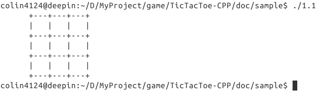

.. _step1:

1. 棋盘界面
===========

.. toctree::
   :maxdepth: 2 
   
1.1 方法一
------------

先实现简单的棋盘，如图 1.1：

分析下，这个界面由四行 ``+---+---+---+`` ，三行 ``|   |   |   |`` 以及左边的空白三部分组成，所以把它们分别存储到三个变量里，这样每次输出就不用敲这些长长的字符，而是用容易记住的变量名代替。

.. code-block:: c++

   #include <iostream>
   #include <string>

   using namespace std;
    
   int main()
   {

        // 定义棋盘 board 
        // 分别存储在 boundary（边界）, bar（栏）以及 sidebar（边栏）的变量里
        string boundary = "+---+---+---+";
        string bar = "|   |   |   |";    
        string sidebar(6, ' '); //空白的左边栏
   
        // 输出界面
        cout << sidebar << boundary << endl;
        cout << sidebar << bar << endl;
        cout << sidebar << boundary << endl;
        cout << sidebar << bar << endl;
        cout << sidebar << boundary << endl;
        cout << sidebar << bar << endl;
        cout << sidebar << boundary << endl;
        
        return 0;  
    }
    
当然，输出界面的代码有很多重复的，可以换成循环输出

.. code-block:: c++

   for (int i = 0; i < 3; ++i)
   {
        cout << sidebar << boundary << endl;
        cout << sidebar << bar << endl;
   }
   
   cout << sidebar << boundary << endl;
   
   
1.2 本阶段完整代码
--------------------

完整代码位于 /doc/sample/1.1.cpp

`在线浏览 <https://gitcafe.com/Tyustca-Project/TicTacToe-CPP/blob/master/doc/sample/1.1.cpp>`_

   

   
   

 
        
   

